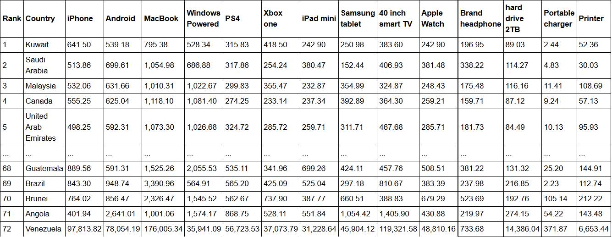
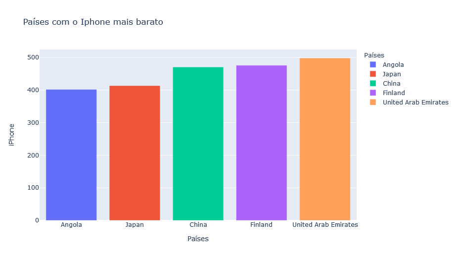
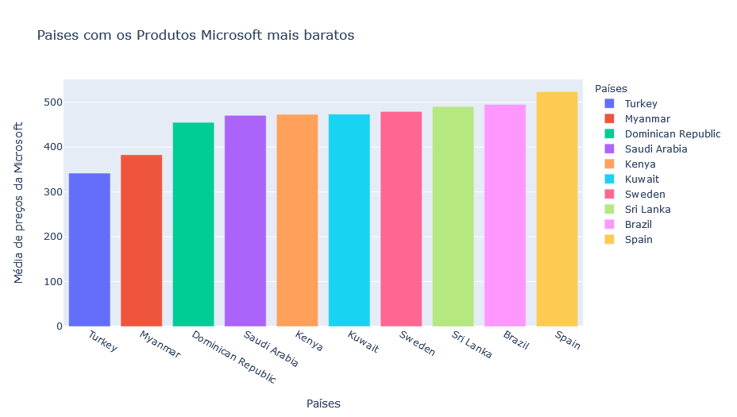
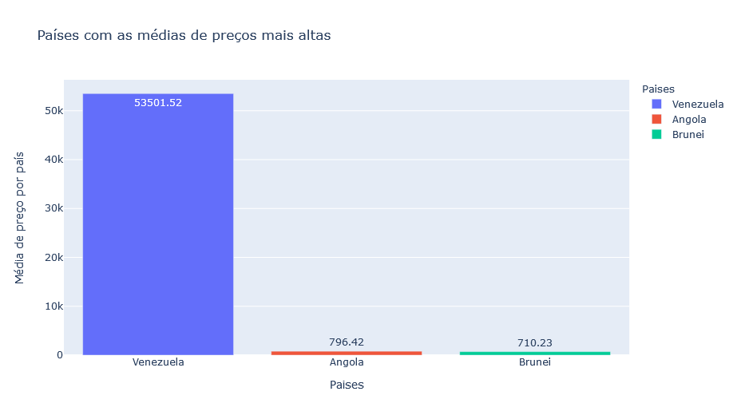
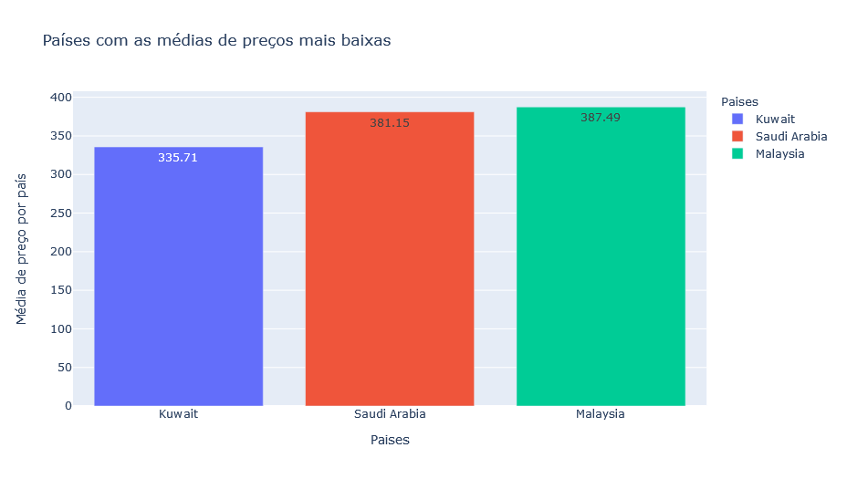

# Custo Produtos de Informática

## Linio.com é a principal plataforma de comércio electrónico da América Latina. Lançou recentemente o Índice de Preços de Tecnologia 2016-17,
## comparando o custo de 14 dispositivos e marcas electrónicas populares, em 72 países.

### Neste projeto foi analisado algumas questões referentes aos dados da Linio.

### Análise Exploratória:
#### Quais são os 5 melhores países para se comprar um iPhone?

#### Qual o melhor país para se comprar produtos da Microsoft?

#### Quais são os 3 países com produtos mais caros?

#### Quais são os 3 países com produtos mais baratos?

